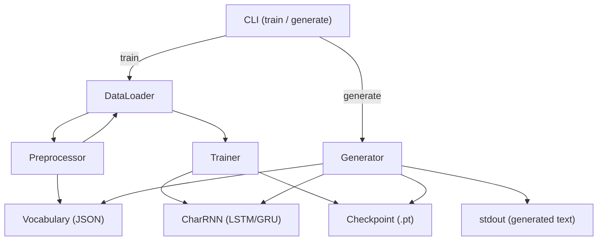

# Design Document

## Overview

This system is a character-level RNN text generation pipeline implemented in Python. It ingests a corpus of handwritten text samples, trains a configurable LSTM or GRU model to predict the next character at each time step, and exposes a CLI for both training and inference.

The core mathematical model:
- Each character is mapped to a dense embedding vector via a learned matrix **W_emb ∈ ℝ^(d_emb × K)**, where K is the vocabulary size.
- The recurrent cell (LSTM or GRU) propagates hidden state **h_t** across time steps using standard gating equations.
- A linear projection followed by softmax produces a probability distribution over K characters at each step.
- During training, cross-entropy loss is averaged over sequence length T and minimized via BPTT with gradient clipping by global norm.
- During inference, temperature scaling is applied before softmax: **P(c) = exp(l_c / τ) / Σ exp(l_j / τ)**, where τ > 0 controls randomness.

The implementation targets PyTorch as the deep learning framework, with the `datasets` library for HuggingFace dataset access.

---

## Architecture



The system is organized into five modules:

| Module | Responsibility |
|---|---|
| `preprocessor.py` | Vocabulary building, text normalization, serialization |
| `dataset.py` | Dataset loading, train/val split, sequence batching |
| `model.py` | CharRNN architecture (embedding + RNN + linear head) |
| `trainer.py` | Training loop, checkpointing, resume logic |
| `generator.py` | Inference: seed priming, temperature sampling |
| `cli.py` | Argument parsing, command dispatch |

---

## Components and Interfaces

### Preprocessor

```python
class Preprocessor:
    def build_vocab(self, texts: list[str]) -> None: ...
    def encode(self, text: str) -> list[int]: ...
    def decode(self, indices: list[int]) -> str: ...
    def save_vocab(self, path: str) -> None: ...
    @classmethod
    def load_vocab(cls, path: str) -> "Preprocessor": ...

    # Public attributes after build_vocab / load_vocab
    char_to_idx: dict[str, int]
    idx_to_char: dict[int, str]
    vocab_size: int
```

`build_vocab` normalizes each text (strip non-printable chars, normalize whitespace), collects unique characters, and assigns sorted integer indices. `save_vocab` writes `{"char_to_idx": {...}, "idx_to_char": {...}}` to JSON. `load_vocab` reconstructs the same mappings.

### DataLoader

```python
class TextDataLoader:
    def __init__(self, source: str, seq_len: int, batch_size: int,
                 val_ratio: float = 0.1, seed: int = 42): ...
    def load(self) -> tuple[DataLoader, DataLoader, Preprocessor]: ...
```

`source` is either a local file path or a HuggingFace dataset identifier (e.g., `"roneneldan/TinyStories"`). Returns `(train_loader, val_loader, preprocessor)`. Each batch is a pair `(inputs, targets)` of shape `(batch_size, seq_len)` where `targets` is `inputs` shifted by one position.

### CharRNN Model

```python
class CharRNN(nn.Module):
    def __init__(self, vocab_size: int, embed_dim: int, hidden_dim: int,
                 num_layers: int, dropout: float, cell_type: str = "lstm"): ...
    def forward(self, x: Tensor, hidden: Hidden) -> tuple[Tensor, Hidden]: ...
    def init_hidden(self, batch_size: int) -> Hidden: ...
```

`x` has shape `(batch_size, seq_len)`. Output logits have shape `(batch_size, seq_len, vocab_size)`. `Hidden` is `tuple[Tensor, Tensor]` for LSTM or a single `Tensor` for GRU. Dropout is applied between stacked recurrent layers (not after the final layer).

### Trainer

```python
class Trainer:
    def __init__(self, model: CharRNN, train_loader: DataLoader,
                 val_loader: DataLoader, config: TrainingConfig): ...
    def train(self) -> None: ...
    def _save_checkpoint(self, epoch: int, val_loss: float) -> None: ...
    def _load_checkpoint(self) -> int: ...  # returns start epoch
```

`TrainingConfig` is a dataclass holding: `lr`, `epochs`, `grad_clip`, `checkpoint_dir`, `log_interval`, `seed`.

Checkpoint format (`.pt` file via `torch.save`):
```python
{
    "epoch": int,
    "model_state": dict,
    "optimizer_state": dict,
    "train_losses": list[float],
    "val_losses": list[float],
}
```

### Generator

```python
class Generator:
    def __init__(self, checkpoint_path: str, vocab_path: str): ...
    def generate(self, seed_text: str, num_chars: int,
                 temperature: float = 1.0) -> str: ...
```

Loads model and vocabulary from disk, primes hidden state with `seed_text` if provided, then samples `num_chars` characters using temperature-scaled softmax.

### CLI

```
python -m handwritten_rnn train \
    --data <source> --output-dir <dir> \
    --seq-len 100 --batch-size 64 --epochs 20 \
    --lr 0.001 --hidden-dim 256 --num-layers 2 \
    --cell-type lstm --dropout 0.2 --grad-clip 5.0 \
    --seed 42

python -m handwritten_rnn generate \
    --checkpoint <path> --vocab <path> \
    --seed-text "Hello" --num-chars 500 --temperature 0.8
```

---

## Data Models

### Vocabulary JSON Schema

```json
{
  "char_to_idx": { "a": 0, "b": 1, "...": "..." },
  "idx_to_char": { "0": "a", "1": "b", "...": "..." }
}
```

Keys in `idx_to_char` are strings (JSON requirement); the loader converts them back to integers on load.

### TrainingConfig Dataclass

```python
@dataclass
class TrainingConfig:
    data_source: str
    output_dir: str
    seq_len: int = 100
    batch_size: int = 64
    epochs: int = 20
    lr: float = 1e-3
    hidden_dim: int = 256
    embed_dim: int = 64
    num_layers: int = 2
    cell_type: str = "lstm"       # "lstm" | "gru"
    dropout: float = 0.2
    grad_clip: float = 5.0
    log_interval: int = 1         # epochs between log lines
    val_ratio: float = 0.1
    seed: int = 42
    checkpoint_dir: str = "checkpoints"
```

### Sequence Batch

Each training batch is a pair of `torch.LongTensor` of shape `(batch_size, seq_len)`:
- `inputs[b, t]` = index of character at position t in sample b
- `targets[b, t]` = index of character at position t+1 (next-char prediction)


---

## Correctness Properties

*A property is a characteristic or behavior that should hold true across all valid executions of a system — essentially, a formal statement about what the system should do. Properties serve as the bridge between human-readable specifications and machine-verifiable correctness guarantees.*

### Property 1: Text normalization removes non-printable characters

*For any* string containing arbitrary non-printable characters and whitespace sequences, applying the Preprocessor's normalization function shall produce a string that contains no non-printable characters and has no leading, trailing, or consecutive internal whitespace.

**Validates: Requirements 1.2**

---

### Property 2: Vocabulary is a complete bijection over the corpus

*For any* text corpus, the Character_Vocabulary built by the Preprocessor shall contain exactly the set of unique characters present in that corpus, and the char-to-index mapping shall be injective (no two characters share an index, and no two indices share a character).

**Validates: Requirements 1.3, 1.4**

---

### Property 3: Train/validation split preserves total size and respects ratio

*For any* dataset of N samples and any valid split ratio r ∈ (0, 1), the resulting train and validation subsets shall together contain exactly N samples, and the fraction of training samples shall be within one sample of r × N.

**Validates: Requirements 1.5**

---

### Property 4: All produced sequences have exactly the configured length

*For any* corpus and any configured sequence length L, every sequence produced by the DataLoader shall have exactly L tokens.

**Validates: Requirements 1.7**

---

### Property 5: Vocabulary serialization round-trip

*For any* Character_Vocabulary, serializing it to JSON and then deserializing it shall produce char_to_idx and idx_to_char mappings that are identical to the originals.

**Validates: Requirements 2.1, 2.2**

---

### Property 6: RNN output is a valid logit tensor over the vocabulary

*For any* model configuration (vocab_size, embed_dim, hidden_dim, num_layers) and any input batch of shape (B, T), the model's forward pass shall produce logits of shape (B, T, vocab_size), and applying softmax over the last dimension shall yield values that sum to 1.0 per time step (within floating-point tolerance).

**Validates: Requirements 3.3**

---

### Property 7: Step-by-step hidden state threading is equivalent to full-sequence forward pass

*For any* input sequence, processing it character-by-character while threading the hidden state between calls shall produce logits identical to processing the full sequence in a single forward pass.

**Validates: Requirements 3.4**

---

### Property 8: Gradient clipping bounds the global norm

*For any* set of gradient tensors whose global L2 norm exceeds a configured threshold τ, after applying gradient clipping the global norm of the clipped gradients shall be ≤ τ.

**Validates: Requirements 4.3**

---

### Property 9: Checkpoint round-trip preserves full training state

*For any* training state (model weights, optimizer state, epoch number, loss history), saving a checkpoint and then loading it shall recover a state that is field-for-field identical to the original.

**Validates: Requirements 4.6**

---

### Property 10: Best checkpoint corresponds to minimum validation loss

*For any* sequence of validation losses recorded across epochs, the checkpoint designated as "best" shall correspond to the epoch with the minimum validation loss in that sequence.

**Validates: Requirements 4.8**

---

### Property 11: Temperature scaling produces the correct sampling distribution

*For any* logit vector **l** and any temperature τ > 0, the probability distribution produced by the Generator's sampling function shall equal softmax(**l** / τ) element-wise (within floating-point tolerance).

**Validates: Requirements 5.4**

---

### Property 12: Generated output length equals num_chars

*For any* valid checkpoint, vocabulary, and configured num_chars value, the string returned by `Generator.generate()` shall have exactly num_chars characters.

**Validates: Requirements 5.5**

---

### Property 13: Identical seeds produce identical weights after training

*For any* training configuration and integer seed, two independent training runs executed with the same configuration and seed on the same hardware shall produce model checkpoints with bit-identical weights after the first epoch.

**Validates: Requirements 7.3**

---

## Error Handling

| Condition | Component | Behavior |
|---|---|---|
| Invalid/unreachable data source | DataLoader | Raise `ValueError` with source path/identifier in message |
| Missing vocabulary file | Preprocessor.load_vocab | Raise `FileNotFoundError` with file path |
| Malformed vocabulary JSON | Preprocessor.load_vocab | Raise `ValueError` with file path and parse error detail |
| OOV character in seed text | Generator | Raise `ValueError` identifying the specific character |
| Temperature ≤ 0 | Generator | Raise `ValueError` stating temperature must be positive |
| Missing required CLI argument | CLI (argparse) | Print usage to stderr, exit with code 2 |
| Checkpoint file missing on resume | Trainer | Log warning, start training from scratch |

All error messages must include enough context for the user to identify and fix the problem without reading source code.

---

## Testing Strategy

### Unit Tests (example-based)

Focus on specific behaviors, integration points, and error conditions:

- `Preprocessor`: normalization examples, OOV handling, malformed vocab file errors
- `DataLoader`: local file loading, HuggingFace identifier loading, invalid source error
- `CharRNN`: LSTM vs GRU instantiation, dropout behavior (train vs eval mode), hidden state initialization
- `Trainer`: loss logging at configured interval, val loss recorded per epoch, resume from checkpoint, best-model designation
- `Generator`: seed text priming changes output, no-seed initializes hidden to zeros, OOV error, temperature ≤ 0 error
- `CLI`: all required arguments parsed, missing argument exits non-zero, generate prints to stdout

### Property-Based Tests

Use **Hypothesis** (Python) as the property-based testing library. Each property test runs a minimum of **100 iterations**.

Each test is tagged with a comment in the format:
`# Feature: handwritten-text-generation, Property N: <property_text>`

| Property | Test Description | Generators |
|---|---|---|
| P1: Normalization | Random strings with non-printable chars and whitespace | `st.text()` with unicode categories |
| P2: Vocab bijectivity | Random text corpora | `st.lists(st.text(min_size=1))` |
| P3: Split ratio | Random dataset sizes and ratios | `st.integers(10, 10000)`, `st.floats(0.05, 0.5)` |
| P4: Sequence length | Random corpora and seq_len values | `st.integers(5, 200)` |
| P5: Vocab round-trip | Random character sets | `st.sets(st.characters())` |
| P6: Output distribution | Random model configs and input batches | `st.integers(5, 50)` for dims |
| P7: Hidden state consistency | Random sequences and model configs | `st.integers(1, 20)` for seq_len |
| P8: Gradient clipping | Random gradient tensors and thresholds | `st.floats(0.1, 10.0)` |
| P9: Checkpoint round-trip | Random training states | `st.integers(1, 100)` for epoch |
| P10: Best checkpoint | Random loss sequences | `st.lists(st.floats(0.1, 10.0), min_size=2)` |
| P11: Temperature scaling | Random logit vectors and temperatures | `st.floats(0.01, 10.0)` for τ |
| P12: Output length | Random num_chars values | `st.integers(1, 1000)` |
| P13: Reproducibility | Fixed small corpus, random seeds | `st.integers(0, 2**31)` |

### Integration Tests

- End-to-end `train` → `generate` pipeline on a small synthetic corpus
- HuggingFace dataset loading (requires network; marked with `@pytest.mark.integration`)
- Checkpoint resume: train 2 epochs, interrupt, resume, verify final weights match uninterrupted 4-epoch run

### Test Configuration

```toml
# pyproject.toml
[tool.pytest.ini_options]
markers = ["integration: requires network or external resources"]

[tool.hypothesis]
max_examples = 100
```
